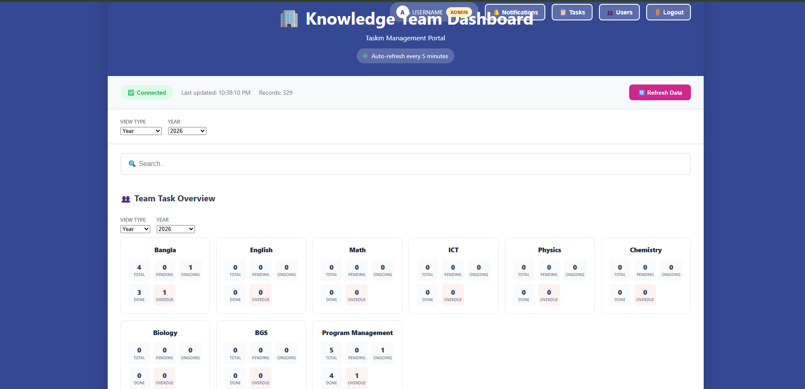
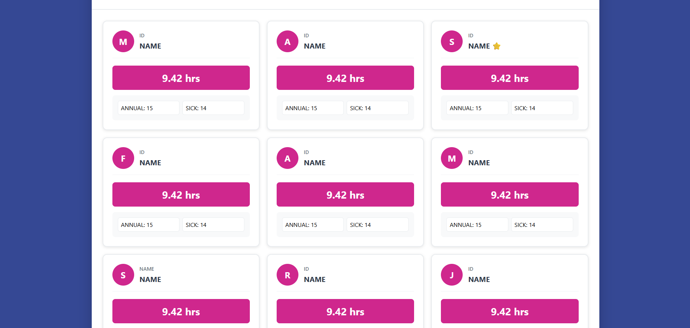

### ✨Task Management & Employee Analytics System


---

## 🚀 About the Project

The **Knowledge Team Dashboard** is a complete **task management and employee monitoring system** designed to manage teams, track productivity, and streamline workflows — all in one place.

This is a **vibe coding project**, built with creativity, consistency, and real-world problem solving.

It combines:

- 📋 Task Management  
- 👥 Employee Tracking  
- 📊 Performance Analytics  
- 🏖️ Leave Management  
- 🔔 Notification System  

into a single powerful dashboard.

---

## 🖼️ Preview

### 📊 Admin Dashboard (Team Overview)


### 👤 Employee Performance Cards


---

## 📅 Project Timeline

- 🟢 **Started:** December 2, 2025  
- 🔵 **Completed:** January 26, 2026  

---

## ⚡ Core Features

### 🔐 Authentication & Role System
- Login & Signup system  
- Firebase Authentication  
- Role-based access:
  - 👑 Admin  
  - 👨‍💻 Employee  

---

### 📋 Task Management
- Assign tasks with:
  - Priority (Low / Medium / High)  
  - Due dates  
- Track task status:
  - ⏳ Pending  
  - 🚧 In Progress  
  - ✅ Completed  
  - 🔥 Overdue  

---

### 📊 Smart Dashboard
- Real-time analytics  
- Work hour tracking  
- Task performance overview  
- Auto-refresh system  

---

### 👥 Team Management
- Multi-team support (Math, ICT, Physics, etc.)  
- Admin can manage users and roles  

---

### ⏱️ Attendance System
- Daily check-in/check-out tracking  
- Total hours calculation  
- Filters:
  - Year  
  - Month  
  - Day  

---

### 🏖️ Leave Management
- Annual Leave  
- Casual Leave  
- Sick Leave  
- Work From Home  

---

### 🔔 Notification System
- Admin approval requests  
- Notification center  
- Real-time updates  

---

## 🛠️ Tech Stack

- **HTML5** – Structure  
- **CSS3** – Styling & UI  
- **JavaScript (Vanilla JS)** – Logic & Interactivity  
- **Firebase** – Authentication & Database  
- **Google Sheets API** – Data source  

---

## 📦 How to Run

```bash
# Clone the repository
git clone https://github.com/akmshamimulislam/Task-Management-Employee-Analytics-System

# Open project folder
cd your-repo

# Run
Open index.html in your browser
````

---

## ⚙️ Required Configuration (IMPORTANT ⚠️)

Before running this project, you **MUST update the configuration values**, otherwise the system will **NOT work properly**.

---

### 🔥 1. Firebase Configuration

Find this inside your code:

```js
const firebaseConfig = {
  apiKey: "YOUR_FIREBASE_apiKey",
  authDomain: "YOUR_FIREBASE_authDomain",
  projectId: "YOUR_FIREBASE_projectId",
  storageBucket: "YOUR_FIREBASE_storageBucket",
  messagingSenderId: "YOUR_FIREBASE_messagingSenderId",
  appId: "YOUR_FIREBASE_appId"
};
```

### ✅ Replace with your real Firebase credentials

👉 Get from:
Firebase Console → Project Settings → Your Apps

---

### 🔥 2. Google Sheet Configuration

Find this:

```js
const SHEET_ID = 'YOUR_GOOGLE_SHEET_ID';
const SHEET_NAME = 'YOUR_SHEET_NAME';
```

### ✅ Replace with your values

* **SHEET_ID** → from Google Sheet URL
* **SHEET_NAME** → your sheet tab name

Example:

```js
const SHEET_ID = '1AbCdEfGhIjKlMnOpQrStUvWxYz';
const SHEET_NAME = 'Attendance';
```

---

### ⚠️ Important Notes

* Google Sheet must be **public or accessible**
* Firebase must be properly configured
* Otherwise:

  * ❌ Login won’t work
  * ❌ Data won’t load
  * ❌ Dashboard will be empty

---

## 🔐 Authentication Setup (IMPORTANT ⚠️)

This project uses **Firebase Authentication**.

---

### 🧾 How to Use

1. Open the project
2. Go to **Sign Up**
3. Enter:

   * Name
   * Employee ID
   * Email
   * Password
   * Team
4. Click **Create Account**

---

### 🔑 Login

* Use your created email & password
* You will log in as **Employee**

---

### 👑 Make Yourself Admin

Go to Firebase → Firestore Database → Users collection

Change:

```js
role: "employee"
```

To:

```js
role: "admin"
```

---

## 📂 Project Structure

```
📁 project/
 ├── index.html
 ├── dashboard.png
 ├── employee.png
 └── README.md
```

---

## 🧠 Learning Outcomes

* Real-world system design
* Role-based architecture
* Advanced DOM manipulation
* UI/UX design thinking
* Problem-solving mindset

---

## 👨‍💻 Author

**A. K. M Shamimul Islam**

---

## ⭐ Final Note

> This is not just a project —
> this is a complete system built from scratch with logic, consistency, and vibe.

🚀 *“From idea → execution → full product.”*

